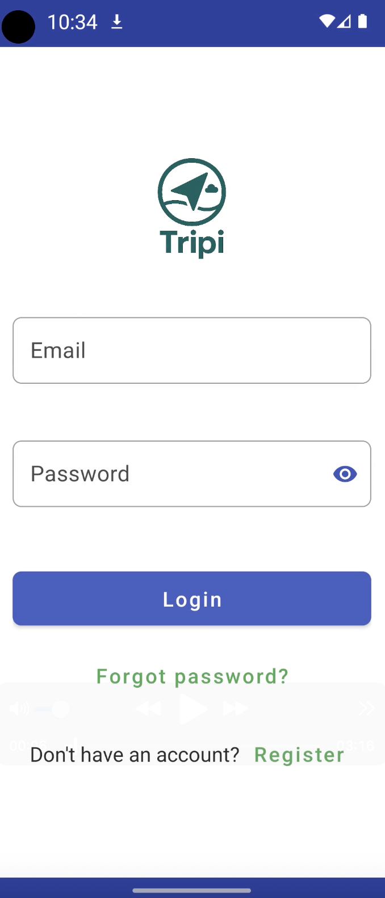
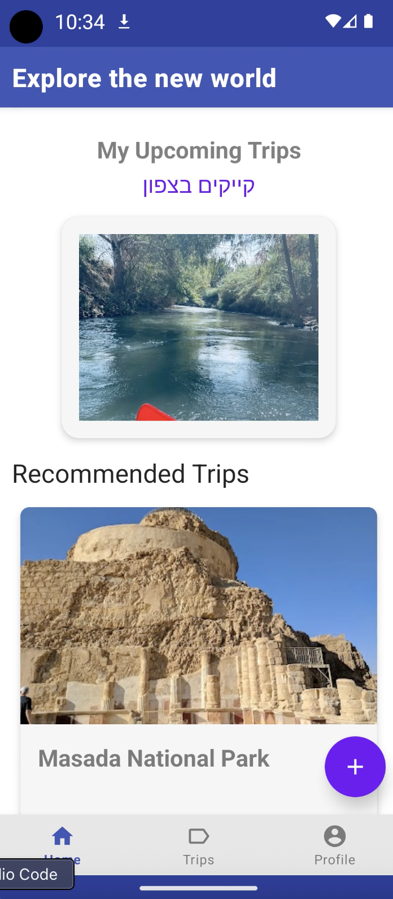

🌍 Tripi – Your Personal Travel Planner

Tripi is a modern travel planning app that allows users to discover, create, manage, and share trips easily. With Tripi, you can plan your next adventure, invite friends, add destinations with real-time information, and view everything on an interactive map.

⸻

✨ Key Features
	•	✅ User Authentication – Secure registration, login, and profile management.
	•	✅ Explore Destinations – Browse nearby attractions and recommended trips.
	•	✅ Trip Creation – Add multiple stops, photos, and itinerary details.
	•	✅ Friends & Collaboration – Invite friends to join and co-edit trips.
	•	✅ Interactive Maps – Google Maps integration for route visualization.
	•	✅ Firebase Sync – Real-time data storage and image uploads.
	•	✅ Modern Material Design UI – Clean and responsive navigation.

⸻

📱 Screens Overview

Screen Name	Description	APIs Used	Libraries
LoginActivity	Allows users to log in or redirect to Register screen.	Firebase Auth	Material Design, SharedPreferences
RegisterActivity	User registration with email, password, and profile setup.	Firebase Auth	Material Design
MainActivity	Home page showing nearby trip suggestions and quick access navigation.	Geoapify Places API, OpenTripMap API	RecyclerView, Glide
CreateTripActivity	Create a trip with multiple destinations, upload images, and invite friends.	Google Places API, Firebase Storage, Firestore	ViewPager, Glide, RecyclerView
TripDetailsActivity	Displays full trip info with itinerary, images, and map routes.	Google Maps SDK, OpenTripMap API	Glide, ViewPager, CardView
MyTripsActivity	Lists all personal and shared trips for quick management.	Firebase Firestore	RecyclerView, LiveData
FriendsActivity	Manage friend list and send invitations to trips.	Firebase Firestore	RecyclerView, Material Buttons
ProfileActivity	View personal information and profile picture.	Firebase Firestore	Glide, CardView
EditProfileActivity	Update user profile details and upload a new image.	Firebase Storage, Firestore	Glide, ImagePicker

⸻

🛠 Tech Stack
	•	Language: Kotlin
	•	Architecture: MVVM (Model-View-ViewModel) with LiveData & Data Binding
	•	UI: Material Design, RecyclerView, CardView, BottomNavigationView
	•	APIs:
	•	Firebase Authentication & Firestore – User accounts and real-time data
	•	Firebase Storage – Image uploads for trips and profiles
	•	Google Maps SDK – Map and route visualization
	•	Geoapify Places API – Nearby trip recommendations
	•	OpenTripMap API – Place details and images
	•	Libraries:
	•	Glide – Image loading
	•	ViewPager – Image galleries
	•	SharedPreferences – Local session storage

⸻

📸 Screenshots

  
  
  

  
  
  

⸻

🚀 Installation
	1.	Clone the repository:

git clone https://github.com/yourusername/tripi.git

	2.	Open in Android Studio.
	3.	Configure your API keys:
	•	google-services.json for Firebase
	•	Add Geoapify and OpenTripMap keys in strings.xml
	4.	Build and run on an emulator or physical device.

⸻

📌 Project Structure

Tripi/
 ├── app/
 │   ├── activities/        # All activities (screens)
 │   ├── adapters/          # RecyclerView adapters
 │   ├── models/            # Data models
 │   ├── utils/             # Helper classes
 │   ├── res/layout/        # XML layouts
 │   └── assets/screenshots/ # App screenshots
 ├── build.gradle.kts
 └── README.md

⸻

🔮 Future Enhancements
	•	Offline mode for saved trips
	•	AI-powered destination suggestions
	•	Trip expense tracking and budgeting tools
	•	Real-time group trip editing with live chat

⸻

👨‍💻 Authors
	•	Dvir Siksik
	•	[Additional contributors here]

⸻

📝 License

This project is licensed under the MIT License – you are free to use and modify it.
