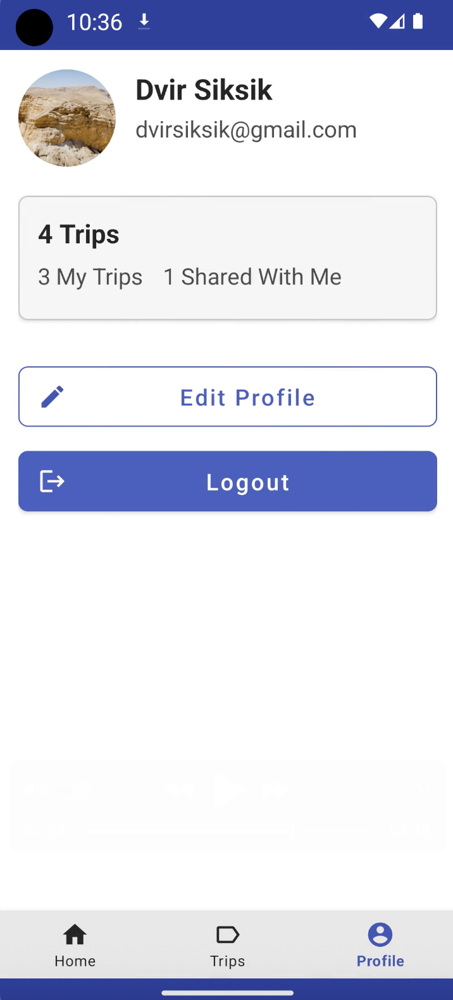

# 🌍 Tripi – Your Personal Travel Planner

Tripi is a modern **travel planning app** that allows users to **discover, create, manage, and share trips** easily.  
With Tripi, you can plan your next adventure, invite friends, add destinations with real-time information, and view everything on an **interactive map**.

---

## ✨ Key Features

- ✅ **User Authentication** – Secure registration, login, and profile management.  
- ✅ **Explore Destinations** – Browse nearby attractions and recommended trips.  
- ✅ **Trip Creation** – Add multiple stops, photos, and itinerary details.  
- ✅ **Friends & Collaboration** – Invite friends to join and co-edit trips.  
- ✅ **Interactive Maps** – Google Maps integration for route visualization.  
- ✅ **Firebase Sync** – Real-time data storage and image uploads.  
- ✅ **Modern Material Design UI** – Clean and responsive navigation.  

---

## 📱 Screens Overview

| **Screen Name**       | **Description**                                                           | **APIs Used**                                     | **Libraries**                          |
|------------------------|--------------------------------------------------------------------------|--------------------------------------------------|----------------------------------------|
| **LoginActivity**      | Allows users to log in or redirect to Register screen.                  | Firebase Auth                                     | Material Design, SharedPreferences      |
| **RegisterActivity**   | User registration with email, password, and profile setup.              | Firebase Auth                                     | Material Design                         |
| **MainActivity**       | Home page showing nearby trip suggestions and quick access navigation.  | Geoapify Places API
| RecyclerView, Glide                     |
| **CreateTripActivity** | Create a trip with multiple destinations, upload images, and invite friends. | Google Places API, Firebase Storage, Firestore    | ViewPager, Glide, RecyclerView          |
| **TripDetailsActivity**| Displays full trip info with itinerary, images, and map routes.         | Google Maps SDK                | Glide, ViewPager, CardView              |
| **MyTripsActivity**    | Lists all personal and shared trips for quick management.               | Firebase Firestore                                | RecyclerView, LiveData                   |
| **ProfileActivity**    | View personal information and profile picture.                         | Firebase Firestore                                | Glide, CardView                          |
| **EditProfileActivity**| Update user profile details and upload a new image.                    | Firebase Storage, Firestore                       | Glide, ImagePicker                       |

---

## 🛠 Tech Stack

- **Language:** Kotlin  
- **Architecture:** MVVM (Model-View-ViewModel) with LiveData & Data Binding  
- **UI:** Material Design, RecyclerView, CardView, BottomNavigationView  

### APIs:
- Firebase Authentication & Firestore – User accounts and real-time data  
- Firebase Storage – Image uploads for trips and profiles  
- Google Maps SDK – Map and route visualization  
- Geoapify Places API – Nearby trip recommendations  
- OpenTripMap API – Place details and images  

### Libraries:
- Glide – Image loading  
- ViewPager – Image galleries  
- SharedPreferences – Local session storage  

---

## 📸 Screenshots

<p align="center">
  
  
  
</p>

<p align="center">
  	
  
  
</p>
<p align="center">
  
</p>
---

## 🚀 Installation

1. Clone the repository:
   ```bash
   git clone https://github.com/DvirSiksik/tripi.git
2.	Open in Android Studio.
3.	Configure your API keys:
	•	google-services.json for Firebase
	•	Add Geoapify and OpenTripMap keys in strings.xml
4.	Build and run on an emulator or physical device.

## 📌 Project Structure

	Tripi/
	 ├── app/
	 │   ├── activities/         # All activities (screens)
	 │   ├── adapters/           # RecyclerView adapters
	 │   ├── models/             # Data models
	 │   ├── utils/              # Helper classes
	 │   ├── res/layout/         # XML layouts
	 │   └── assets/screenshots/ # App screenshots
	 ├── build.gradle.kts
	 └── README.md

## 👨‍💻 Authors	
Dvir Siksik


 

 
